# 小白手把手安装教程

本教程将指导您如何从零开始设置并运行本项目。

**本GUI界面只实现了简单的功能支持，更多功能请直接使用命令行脚本 translate.py** [参考这个README](README.md)

## 1. 下载并安装 Python

本项目需要 Python 运行环境。

请访问 [Python 官方网站](https://www.python.org/downloads/) 下载适合您操作系统的最新版 Python 安装包。

**注意：** 在 Windows 上安装时，请务必勾选 "Add Python to PATH" 选项，以便在命令行中直接使用 `python` 命令。

安装完成后，可以在命令行中运行以下命令来验证是否安装成功：

python --version

或者

python3 --version

您应该能看到类似 `Python 3.x.x` 的输出。

## 2. 安装 uv

`uv` 是一个非常快的 Python 包管理工具，我们将使用它来管理本项目的依赖。

打开您的命令行（终端），运行以下命令来安装 `uv`：

pip install uv

或者

pip3 install uv

## 3. 安装Git（非必要。使用zip包则不用安装git，参考步骤4.1）
   访问 [Git 官网](https://git-scm.com/downloads) 下载安装程序。下载后，按照安装向导的默认设置一路点击“下一步”即可。

   您应该能看到类似 `git version 2.x.x` 的输出。

所有工具安装完成，在控制台终端中检查版本类似于下图
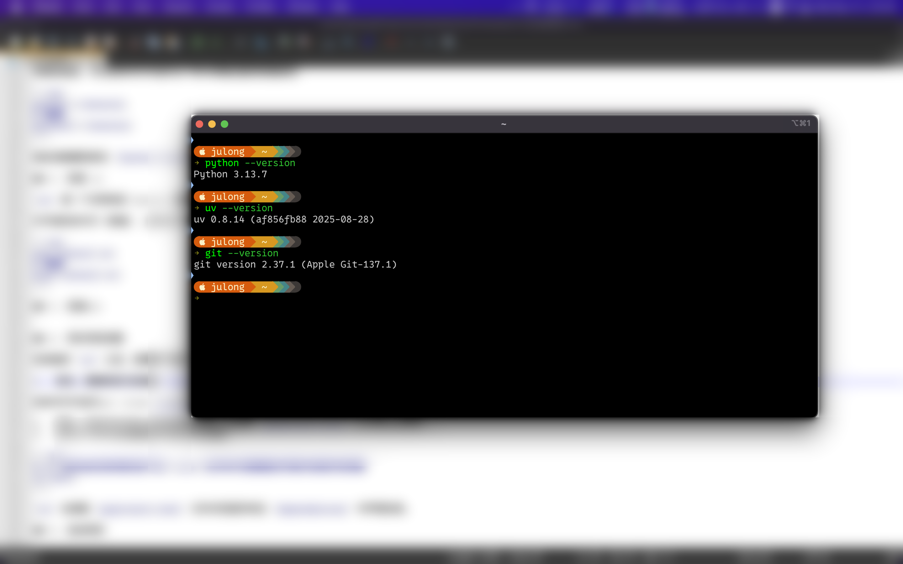

## 4. 同步项目及运行依赖

在安装好 `uv` 之后，您需要下载并安装项目所需的所有库。

1.首先，请确保您已经通过 `git clone` 或下载 zip 包的方式获取了本项目的完整代码。

在命令行中运行以下命令拉取本项目所有代码。

***git clone https://github.com/julong111/JuSubtitleAutoTranslate.git***

git clone网速不好的多试几遍。

如果拉取不顺利时，建议在Github主页选择**手动下载本项目zip包**
按下面图示操作
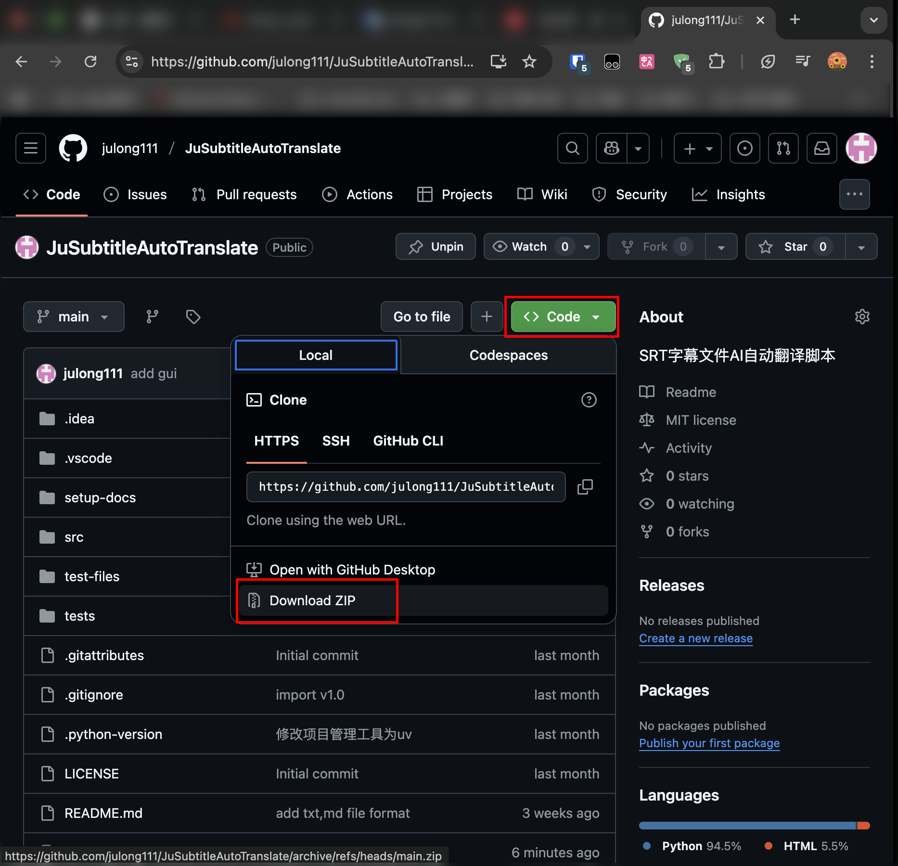
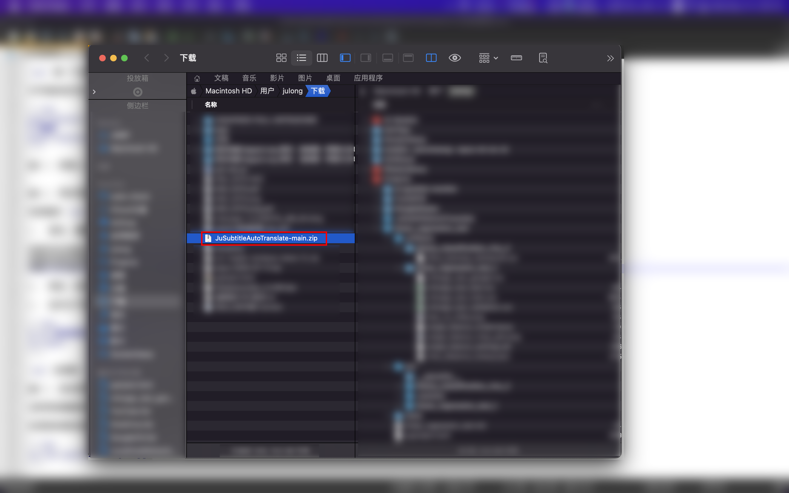
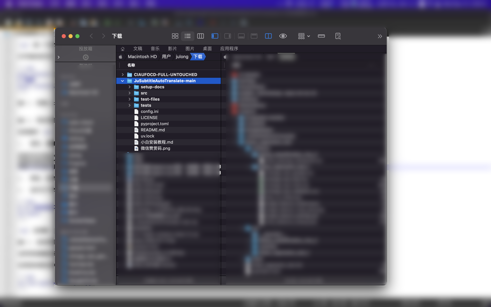
下载完成后解压得到JuSubtitleAutoTranslate-main文件夹。

2.  然后，在命令行中进入到项目的根目录（也就是 `pyproject.toml` 文件所在的目录）。
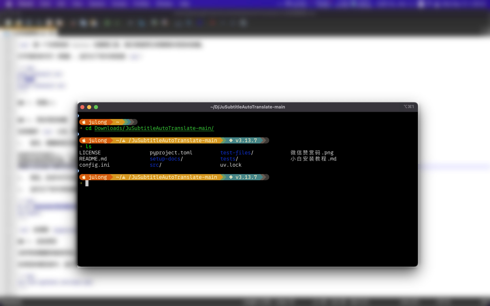

3.  运行以下命令来创建虚拟环境并同步依赖：

uv sync

`uv` 会安装所有运行时依赖的库。

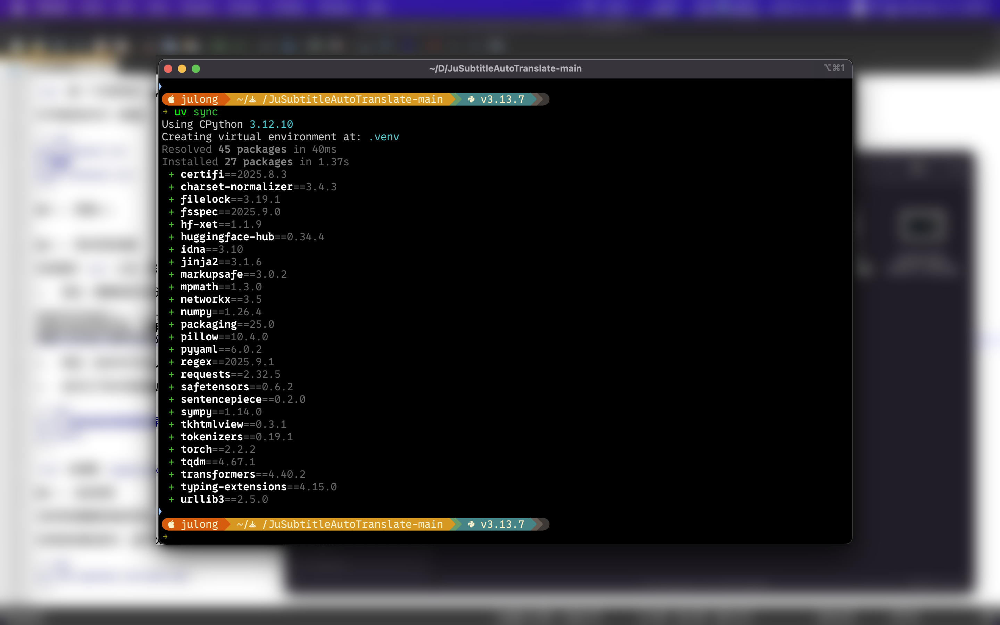
当显示类似这样，就表示安装完成了。

## 4. 启动项目

当所有依赖都安装完毕后，你就可以启动项目的图形界面了。

在项目的根目录中，运行以下命令：

uv run python src/gui.py

如果一切顺利，您将看到项目的 "AI自动翻译工具" 窗口弹出。

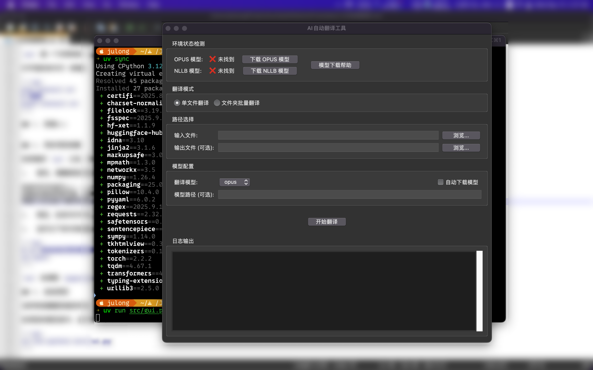
第一次运行还没有下载翻译模型。界面显示模型未找到。

点击【下载OPUS模型按钮】，会弹出下载窗口。
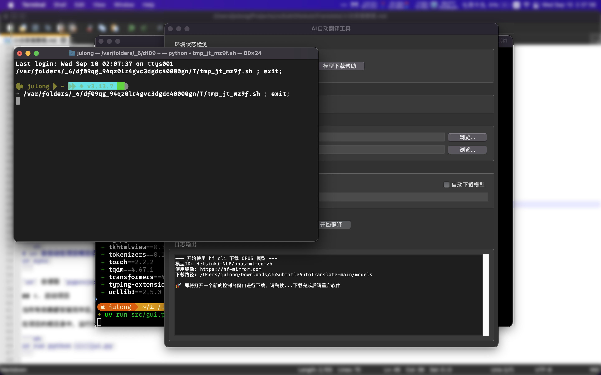
等待下载完成。
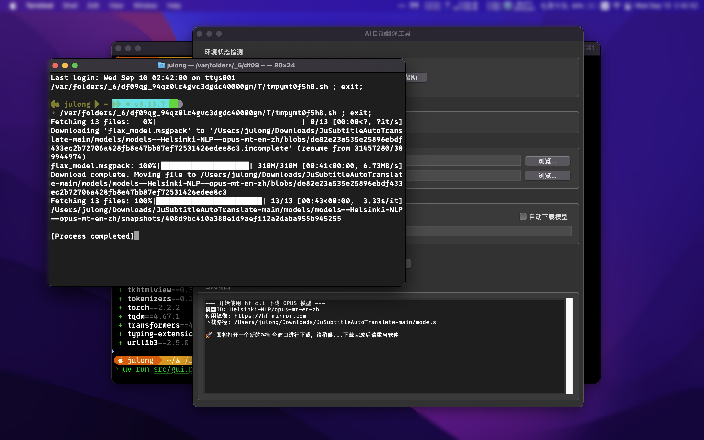
模型较大根据网络环境可能会下载缓慢，请耐心等待。

当模型下载完毕控制台中的**进度条都显示为100%**，会提示类似**Process completed**的提示。就可以关闭控制台窗口了。

如果网络不佳，可以**关闭控制台窗口重新点击下载模型按钮**。它会从上一次下载的**进度恢复**。

当模型下载完成后，关闭并重启软件。

uv run python src/gui.py

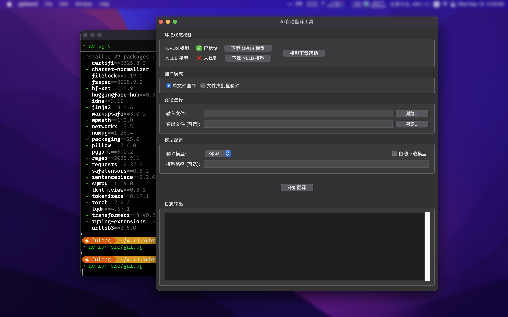
此时界面显示模型**已就绪**。

点击输入文件后面的[**浏览**]按钮。选择工程自带的实例字幕文件 **test-files/sample1-eng.srt**
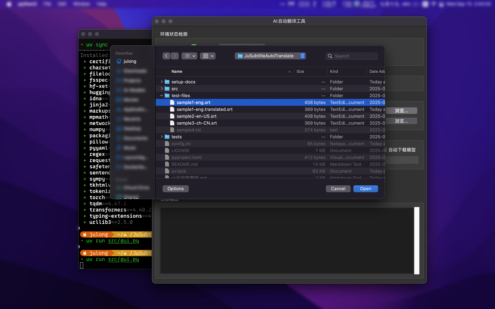

点击[**确定**]，选择文件后，点击界面[**开始翻译**]按钮
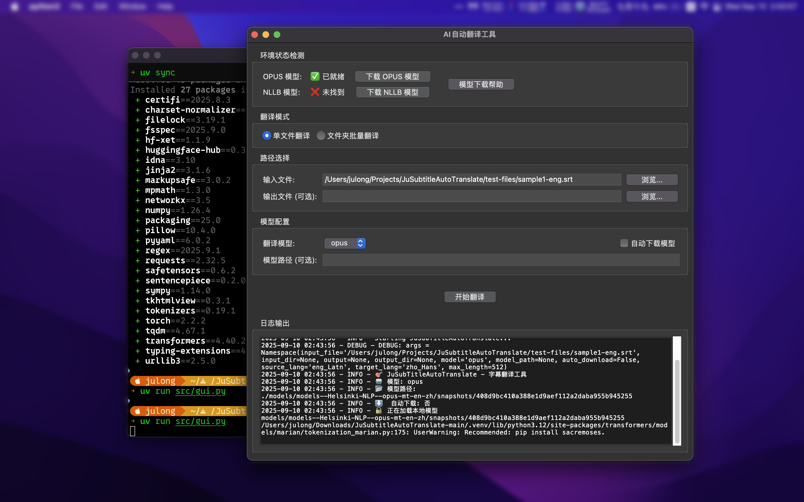

底部日志框显示正在翻译。请等待翻译完成。
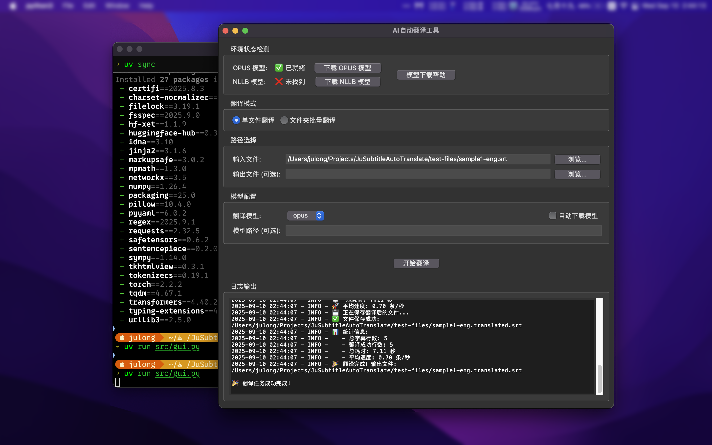
翻译完成后，会显示翻译任务完成。

打开翻译前和翻译后的文件查看
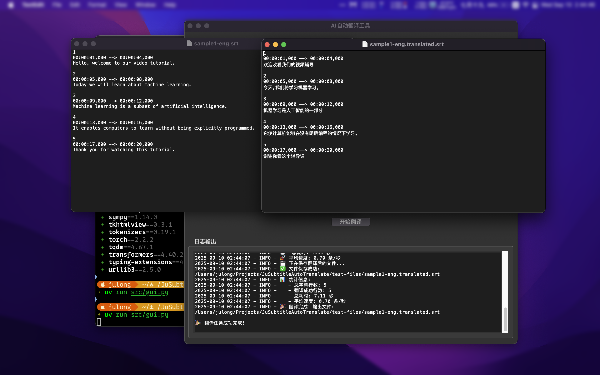

可以看到字幕文件已经翻译为中文，将翻译后的文件复制至相应的视频文件夹中，播放器即可识别。

尝试下载NLLB模型翻译，看看翻译质量会有什么区别。 更多用法参考 [README](README.md)
